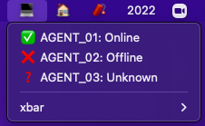

# jenkins-plugin

- Copy script to `~/Library/Application Support/xbar/plugins` and update the following variables in xbar plugins browser:
  - `JENKINS_URL`
  - `JENKINS_AGENTS`
  - `JENKINS_USER_ID`
  - `JENKINS_API_TOKEN`
